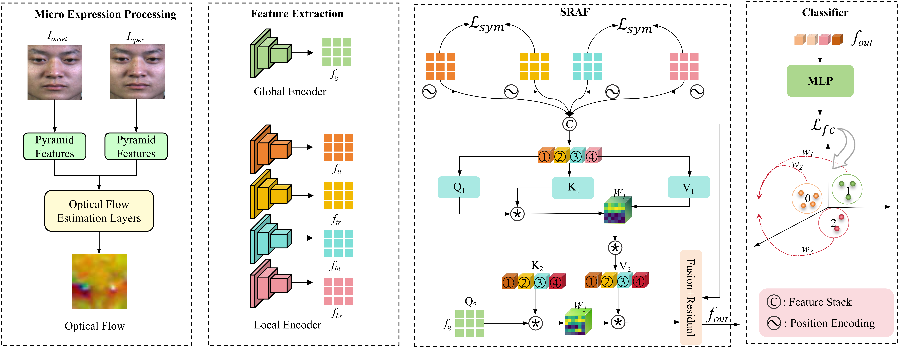

# 🧠 SOFP: Capturing Subtle Facial Dynamics with Symmetric Optical Flow Perception for Micro-Expression Recognition


<p align="center">
  
</p>

<p align="center"><em>Figure 1. Overview of the proposed SOFP framework.</em></p>

---

## 🧩 Abstract

Facial micro-expressions (MEs) are fleeting, involuntary facial movements that reveal genuine emotions and play a key role in lie detection and affective computing. However, existing micro-expression recognition (MER) methods often rely on imprecise priors, such as facial landmark localization and action unit annotations, resulting in incomplete or noisy motion representations. To address these limitations, we propose the Symmetric Optical Flow Perception (SOFP) framework, which partitions the optical flow (OF) into four bilaterally symmetric facial regions to capture both local and global motion cues through attention-guided encoders. Furthermore, we introduce the Symmetric Region-Aware Attention Fusion (SRAF) module, which (i) enforces semantic consistency between symmetric facial regions, (ii) models inter-region dependencies via structure-guided self-attention, and (iii) integrates global-to-local information through adaptive cross-attention fusion. Extensive experiments are conducted under both composite database evaluation (CDE) with leave-one-subject-out (LOSO) cross-validation and single-dataset evaluation (SDE) settings. On the Composite (Full) dataset, SOFP achieves state-of-the-art performance with a UF1 of 92.84% and a UAR of 92.93%. In SDE, SOFP consistently outperforms existing methods across the SAMM, CASME II, CAS(ME)3, and DFME datasets. These results demonstrate that explicitly modeling facial symmetry and region-level motion information enables robust and accurate MER. The source code is publicly available at https://github.com/Healer-ML/MER.

---
## 📚 Citation

If you use this work, please cite:

```bibtex
@article{YU2026113199,
  title   = {SOFP: Capturing Subtle Facial Dynamics with Symmetric Optical Flow Perception for Micro-Expression Recognition},
  journal = {Pattern Recognition},
  pages   = {113199},
  year    = {2026},
  issn    = {0031-3203},
  doi     = {https://doi.org/10.1016/j.patcog.2026.113199},
  url     = {https://www.sciencedirect.com/science/article/pii/S0031320326001640},
  author  = {Kejian Yu and Zhaohui Zhang and Chaochao Hu and Jiehao Luo},
  keywords = {Micro-expression recognition, Optical flow, Symmetric motion perception}
}
